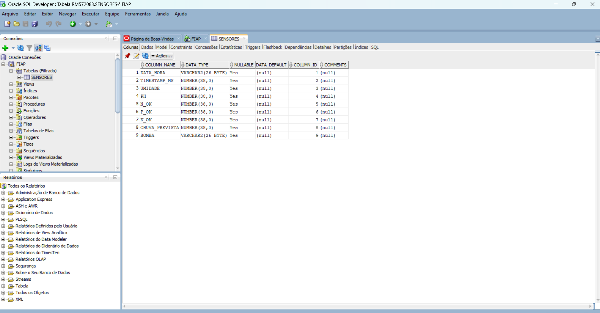

# FarmTech Solutions - Documentacao do Projeto

## Links

- Video demonstrativo: https://youtu.be/mPI2g-Q3YFI
- Repositorio GitHub: https://github.com/TenorioDevfullStack/meugit-cursotiaor-pbl-fase3-pastas

## Visao geral

O projeto FarmTech Solutions implementa um sistema de monitoramento e controle de fertirrigacao usando ESP32, sensores simulados no Wokwi, integracao com clima, armazenamento em CSV, importacao para Oracle e dashboard Streamlit.

A solucao acompanha:

- umidade do solo;
- pH;
- nutrientes N, P e K;
- previsao ou deteccao de chuva;
- status da bomba de irrigacao;
- sugestoes de irrigacao baseadas no clima e nas leituras dos sensores.

## Arquitetura

1. ESP32 no Wokwi faz a leitura dos sensores e controla o rele da bomba.
2. O firmware envia linhas estruturadas no formato `CSV,...` pela Serial.
3. Scripts Python capturam a saida serial e geram `dados_sensores.csv`.
4. O CSV pode ser importado para Oracle.
5. A dashboard Streamlit consome o CSV e a API OpenWeather para visualizacao e sugestoes.

## Componentes principais

- `src/sketch.ino`: firmware do ESP32.
- `coletar_sensores_csv.py`: coleta dados da Serial ou de um arquivo de log e grava CSV.
- `gerar_csv_wokwi_cli.py`: executa o Wokwi CLI e gera CSV automaticamente.
- `importar_csv_oracle.py`: importa o CSV para uma tabela Oracle.
- `dashboard_farmtech.py`: dashboard Streamlit para visualizacao dos indicadores.
- `dados_sensores_wokwi.csv`: exemplo de CSV gerado a partir da simulacao.

## Fluxo de dados

O ESP32 imprime linhas no formato:

```csv
CSV,timestamp_ms,umidade,ph,n_ok,p_ok,k_ok,chuva_prevista,bomba
```

O script Python converte essas linhas para o arquivo:

```csv
data_hora,timestamp_ms,umidade,ph,n_ok,p_ok,k_ok,chuva_prevista,bomba
```

## Banco de dados Oracle

A tabela usada para armazenar os dados dos sensores possui os campos de data/hora, timestamp, umidade, pH, nutrientes, chuva prevista e status da bomba.

Print do banco de dados:



## Dashboard

A dashboard foi criada com Streamlit e apresenta:

- cards com umidade, pH, fosforo, potassio e status da irrigacao;
- graficos historicos de umidade e pH;
- grafico de bomba ligada e chuva prevista;
- status dos nutrientes;
- sugestoes de irrigacao com base na OpenWeather ou na coluna `chuva_prevista`.

Execucao:

```bash
streamlit run dashboard_farmtech.py
```

## Integracao com OpenWeather

A chave da API nao e exibida no front-end. Ela deve ser configurada localmente por uma das opcoes:

```powershell
$env:OPENWEATHER_API_KEY="sua_chave_openweather"
```

Ou no arquivo `.env`:

```env
OPENWEATHER_API_KEY=sua_chave_openweather
```

O arquivo `.env` esta no `.gitignore` para evitar envio de informacoes sensiveis ao GitHub.

## Geracao do CSV pelo Wokwi CLI

Para rodar a simulacao automaticamente pelo Wokwi CLI, configure:

```env
WOKWI_CLI_TOKEN=seu_token_wokwi
```

Depois execute:

```bash
python gerar_csv_wokwi_cli.py --sobrescrever
```

Esse comando compila o firmware, executa a simulacao, salva `serial_wokwi.log` e gera `dados_sensores.csv`.

## Importacao para Oracle

Configure as credenciais do Oracle por variaveis de ambiente:

```powershell
$env:ORACLE_USER="seu_usuario"
$env:ORACLE_PASSWORD="sua_senha"
$env:ORACLE_DSN="host:1521/service_name"
```

Depois execute:

```bash
python importar_csv_oracle.py
```

## Evidencias

- Print Oracle: `print-BD/bd-oracle.png`
- Video demonstrativo: https://youtu.be/mPI2g-Q3YFI
- Repositorio GitHub: https://github.com/TenorioDevfullStack/meugit-cursotiaor-pbl-fase3-pastas
