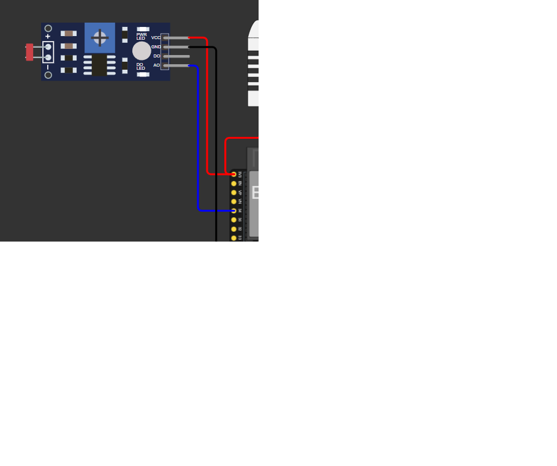
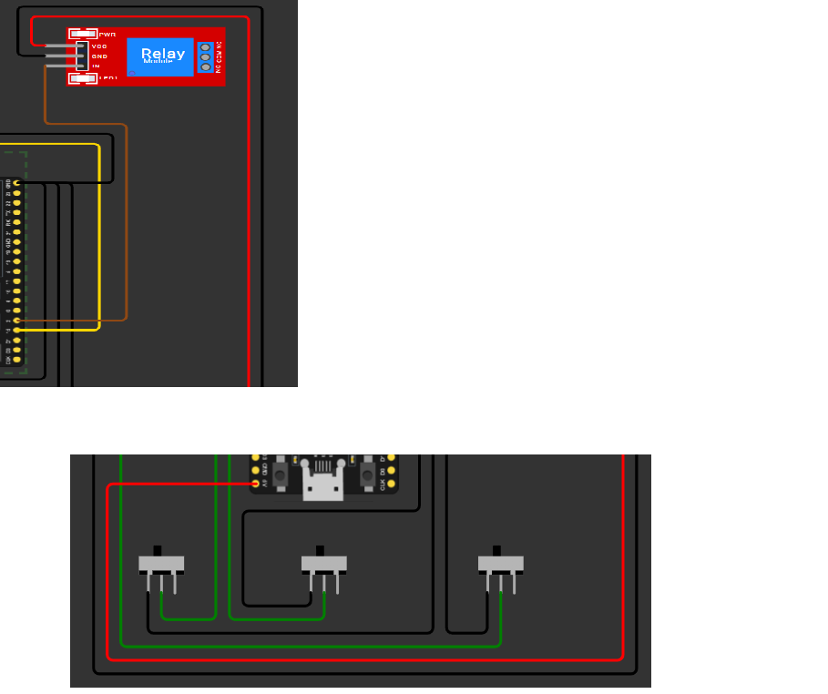

# FarmTech Solutions - Sistema Inteligente de Fertirrigação 🌾

Este projeto faz parte da **Fase 2** do curso de Inteligência Artificial da **FIAP**. A solução consiste em um sistema de monitoramento e controle automatizado para culturas agrícolas (foco em Soja), utilizando IoT para gerir umidade, pH e nutrientes (NPK), integrado com dados climáticos externos.

## 📋 Sumário

- [Visão Geral](#visão-geral)
- [Arquitetura do Sistema](#arquitetura-do-sistema)
- [Funcionalidades](#funcionalidades)
- [Itens Ir Além](#itens-ir-além)
- [Como Executar](#como-executar)
- [Links do Projeto](#links-do-projeto)

## 🔍 Visão Geral

O sistema utiliza um **ESP32** para monitorar sensores de solo. A decisão de acionamento da bomba de irrigação (Relé) baseia-se em uma lógica de múltiplas variáveis: se a umidade estiver baixa, se o pH estiver fora da faixa ideal (6.0 - 6.5) ou se houver falta de nutrientes (N, P ou K), a irrigação é ativada.

## 🏗️ Arquitetura do Sistema

O projeto foi dividido em duas camadas principais:

1. **Hardware (Edge):** ESP32 programado em C++ controlando Sensores (DHT22, LDR, Switches) e Atuador (Relé).
2. **Integração (Python):** Script que consome a API OpenWeather para fornecer dados em tempo real sobre

## 🚀 Funcionalidades

- **Monitoramento de Umidade:** Leitura via sensor DHT22.
- **Controle de pH:** Simulação via sensor LDR (mapeado de 0 a 14).
- **Gestão de Nutrientes:** Monitoramento de Nitrogênio, Fósforo e Potássio via chaves seletoras.
- **Automação de Irrigação:** Acionamento inteligente do Relé.

## 🌟 Itens Ir Além

### 1. Integração com API Externa (Python)

Desenvolvemos um script em Python que monitora o clima local. Caso a API detecte previsão de chuva, o sistema suspende a irrigação automaticamente para economizar recursos hídricos, mesmo que o solo esteja seco.

## 🛠️ Como Executar

### 1. Hardware (Wokwi)

- Acesse o link do projeto no Wokwi.
- Clique em "Play" para iniciar a simulação.
- Acompanhe as leituras no **Serial Monitor**.

### 2. API de Clima (Python)

- Instale as dependências: `pip install -r requirements.txt`
- Execute o script: `python appid.py`
- Siga as instruções no terminal para interagir com o simulador.

### 3. Gerar CSV com dados dos sensores

O ESP32 envia as leituras dos sensores pela Serial em formato estruturado.

#### Usando Wokwi Online

O Wokwi Online mostra os dados no Serial Monitor do navegador. Para criar o arquivo CSV no projeto:

- Execute a simulacao no Wokwi.
- Copie o conteudo do Serial Monitor.
- Cole esse conteudo em um arquivo `.txt`, por exemplo `serial_wokwi.txt`.
- Execute:

```bash
python coletar_sensores_csv.py --entrada serial_wokwi.txt
```

O arquivo `dados_sensores.csv` sera criado na pasta do projeto.

Tambem e possivel colar direto no terminal:

```bash
python coletar_sensores_csv.py --entrada -
```

Depois cole o texto do Serial Monitor e finalize com `Ctrl+Z` + `Enter` no Windows.

#### Coleta automatica com Wokwi CLI

Para coletar automaticamente sem copiar o Serial Monitor manualmente, use o Wokwi CLI. Esse modo roda a simulacao pelo terminal, salva a saida serial e cria o CSV.

Requisitos:

- `wokwi-cli` instalado.
- Token configurado na variavel `WOKWI_CLI_TOKEN`.
- Projeto configurado para Wokwi CLI com `wokwi.toml`, `diagram.json` e firmware/ELF de build.

Este repositorio ja contem:

- `diagram.json`: circuito local do Wokwi.
- `wokwi.toml`: caminhos do firmware para a simulacao.
- `platformio.ini`: configuracao para compilar o ESP32.
- `gerar_csv_wokwi_cli.py`: executa a simulacao e cria o CSV.

Instalacao do Wokwi CLI no PowerShell:

```powershell
iwr https://wokwi.com/ci/install.ps1 -useb | iex
```

Configure o token como variavel de ambiente:

```powershell
$env:WOKWI_CLI_TOKEN="seu_token_wokwi"
```

Ou adicione no `.env` local:

```env
WOKWI_CLI_TOKEN=seu_token_wokwi
```

Depois de configurar o projeto para Wokwi CLI, execute:

```bash
python gerar_csv_wokwi_cli.py --sobrescrever
```

Esse comando cria `serial_wokwi.log` e converte as linhas `CSV,...` para `dados_sensores.csv`.

Se quiser apenas recompilar o firmware:

```bash
python -m platformio run
```

Se o firmware ja estiver compilado e voce quiser pular o build:

```bash
python gerar_csv_wokwi_cli.py --sem-build
```

#### Usando ESP32 fisico

Para gravar direto da porta serial:

- Carregue o sketch `src/sketch.ino` no ESP32.
- Identifique a porta serial do ESP32, por exemplo `COM3` no Windows.
- Execute:

```bash
python coletar_sensores_csv.py --porta COM3
```

Por padrao, o arquivo gerado sera `dados_sensores.csv`, com as colunas:

```csv
data_hora,timestamp_ms,umidade,ph,n_ok,p_ok,k_ok,chuva_prevista,bomba
```

Para escolher outro nome de arquivo:

```bash
python coletar_sensores_csv.py --porta COM3 --saida minha_coleta.csv
```

### 4. Importar CSV para Oracle

O arquivo `dados_sensores.csv` pode ser importado para uma tabela Oracle usando o script `importar_csv_oracle.py`.

Configure os dados de conexao por variaveis de ambiente.

PowerShell:

```powershell
$env:ORACLE_USER="seu_usuario"
$env:ORACLE_PASSWORD="sua_senha"
$env:ORACLE_DSN="host:1521/service_name"
```

Git Bash:

```bash
export ORACLE_USER="seu_usuario"
export ORACLE_PASSWORD="sua_senha"
export ORACLE_DSN="host:1521/service_name"
```

Depois execute:

```bash
python importar_csv_oracle.py
```

Por padrao, o script cria a tabela `DADOS_SENSORES` se ela ainda nao existir e importa os dados de `dados_sensores.csv`.

Para usar outro nome de tabela:

```bash
python importar_csv_oracle.py --tabela SENSOR_LEITURAS
```

Estrutura criada no Oracle:

```sql
CREATE TABLE DADOS_SENSORES (
  id NUMBER GENERATED BY DEFAULT AS IDENTITY PRIMARY KEY,
  data_hora TIMESTAMP NOT NULL,
  timestamp_ms NUMBER NOT NULL,
  umidade NUMBER(8,2),
  ph NUMBER(8,2),
  n_ok NUMBER(1),
  p_ok NUMBER(1),
  k_ok NUMBER(1),
  chuva_prevista NUMBER(1),
  bomba VARCHAR2(20),
  criado_em TIMESTAMP DEFAULT CURRENT_TIMESTAMP,
  CONSTRAINT UK_DADOS_SENSORES_TS UNIQUE (timestamp_ms)
);
```

### 5. Dashboard Streamlit

A dashboard `dashboard_farmtech.py` visualiza os dados do arquivo `dados_sensores.csv`, incluindo umidade, pH, fosforo (P), potassio (K), status da irrigacao e sugestoes baseadas em clima.

Instale as dependencias:

```bash
pip install -r requirements.txt
```

Configure uma chave da OpenWeather para consultar o clima atual. A chave nao e exibida na dashboard; ela deve ficar somente em variavel de ambiente, `.env` local ou `st.secrets`. Sem essa chave, a dashboard usa a coluna `chuva_prevista` do CSV.

PowerShell:

```powershell
$env:OPENWEATHER_API_KEY="sua_chave_openweather"
```

Ou crie um arquivo `.env` na raiz do projeto, seguindo o exemplo de `.env.example`:

```env
OPENWEATHER_API_KEY=sua_chave_openweather
```

Execute:

```bash
streamlit run dashboard_farmtech.py
```

## 🔗 Links do Projeto

- **Documentacao do Projeto:** [DOCUMENTACAO_PROJETO.md](DOCUMENTACAO_PROJETO.md)
- **Vídeo de Demonstração:** [https://youtu.be/mPI2g-Q3YFI]
- **Simulador Wokwi:** [https://wokwi.com/projects/461289392904235009]
- **Repositório GitHub:** [https://github.com/TenorioDevfullStack/meugit-cursotiaor-pbl-fase3-pastas.git]

## 📸 Imagens do Projeto

### Circuito de Sensores no Wokwi

#### DHT22 - Sensor de Umidade e Temperatura


#### LDR - Sensor de pH (Luz)



#### Relé - Controle da Bomba de Irrigação



#### Botões - Sensores de Nutrientes (NPK)


## 👥 Integrantes

Grupo Fiap
Leandro Tenorio:
RM: RM572083
E-mail: tenorioleandro22@gmail.com

---

Nicolas:
RM: 570336
E-mail: nicxaviercosta04@gmail.com

---

Diego:
RM572085
E-mail: dhinobrega@hotmail.com.br

---

Pedro: RM573999
E-mail: pedrohenriquelimaschneider082@gmail.com

---

João:
RM: 570160
E-mail: jpbessa2007@gmail.com

---

_FarmTech Solutions - Tecnologia a serviço do campo._
